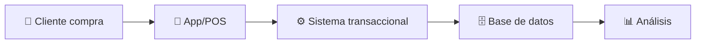
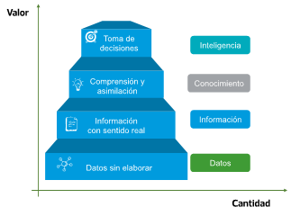

# 💡 Guía de Markdown para Presentaciones

## Enter Tech School

---

## 🔍 Estructura Básica

Las presentaciones se dividen en **diapositivas horizontales** separadas por `---`.

También puedes crear **diapositivas verticales** usando `--`.

---

## Mermaid Flow


---

## Imagen

 <!-- .element: class="img-medium" -->

---

## 🎨 Formato de Texto

Puedes usar **negrita**, *cursiva*, o ~~tachado~~.

También puedes usar `código en línea` o bloques de código:

```javascript
function saludar() {
  console.log("Hola Mundo!");
  return true;
}
```

---

## 📋 Listas

### Listas sin orden
* Primer elemento
* Segundo elemento
  * Elemento anidado
  * Otro elemento anidado
* Tercer elemento

### Listas numeradas
1. Primer paso
2. Segundo paso
3. Tercer paso

---

## 🔗 Enlaces e Imágenes

Puedes incluir [enlaces a recursos](https://entertechschool.com)

Y también imágenes:


---

## 📊 Tablas

| Lenguaje | Nivel | Tipo |
|----------|-------|------|
| HTML     | Básico | Marcado |
| CSS      | Intermedio | Estilo |
| JavaScript | Avanzado | Programación |

---

## 🧩 Diapositivas Verticales

Esta es la diapositiva principal.

--

### Primera subdiapositiva

Contenido más específico.

--

### Segunda subdiapositiva

Detalles adicionales.

---

## 📝 Bloques de Cita

> "La programación no trata solo de escribir código, 
> sino de resolver problemas."
>
> — Alguien Famoso

---

## 💻 Ejemplos de Código

### HTML
```html
<!DOCTYPE html>
<html>
<head>
  <title>Mi página</title>
</head>
<body>
  <h1>Hola Mundo</h1>
</body>
</html>
```

--

### CSS
```css
body {
  font-family: 'Work Sans', sans-serif;
  margin: 0;
  padding: 20px;
  background-color: #f0f0f0;
  color: #333;
}

h1 {
  color: #00d3aa;
  border-bottom: 2px solid #1e2cff;
}
```

--

### JavaScript
```javascript
// Objeto para manejar un contador
const contador = {
  valor: 0,
  incrementar() {
    this.valor++;
    console.log(`Nuevo valor: ${this.valor}`);
    return this.valor;
  },
  decrementar() {
    this.valor--;
    console.log(`Nuevo valor: ${this.valor}`);
    return this.valor;
  }
};
```

---

## 🔢 Elementos Numerados

<ol>
  <li class="fragment">Este elemento aparecerá primero</li>
  <li class="fragment">Este elemento aparecerá segundo</li>
  <li class="fragment">Este elemento aparecerá tercero</li>
</ol>

---

## 📌 Consejos para Presentaciones Efectivas

<div style="text-align: left;">

1. **Mantén el contenido conciso**
   - Usa viñetas para puntos importantes
   - Evita párrafos largos

2. **Utiliza imágenes relevantes**
   - Una imagen vale más que mil palabras
   - Ayuda a la retención del contenido

3. **Incorpora ejemplos prácticos**
   - Muestra código real
   - Demuestra casos de uso

</div>

---

## 🏗️ Ejercicios Prácticos

Para esta clase, vamos a crear:

<div class="fragment">
  <h3>Mini-proyecto: Landing Page Responsiva</h3>
  <p>Aplicando los conceptos de HTML semántico</p>
</div>

<div class="fragment">
  <pre><code class="html">&lt;header&gt;
  &lt;nav&gt;
    &lt;ul&gt;
      &lt;li&gt;&lt;a href="#"&gt;Inicio&lt;/a&gt;&lt;/li&gt;
      &lt;li&gt;&lt;a href="#"&gt;Servicios&lt;/a&gt;&lt;/li&gt;
    &lt;/ul&gt;
  &lt;/nav&gt;
&lt;/header&gt;</code></pre>
</div>

---

## 📱 Diseño Responsivo

<div style="display: flex; justify-content: space-around;">
  <div style="flex: 1; margin-right: 20px;">
    <h3>Mobile First</h3>
    <ul>
      <li>Diseña primero para dispositivos móviles</li>
      <li>Viewport meta tag</li>
      <li>Media queries para pantallas más grandes</li>
    </ul>
  </div>
  <div style="flex: 1;">
    <h3>Desktop First</h3>
    <ul>
      <li>Diseña primero para escritorio</li>
      <li>Media queries para pantallas más pequeñas</li>
      <li>Necesita más ajustes para móviles</li>
    </ul>
  </div>
</div>

---

## 🎯 Objetivos de la Clase

- [x] Entender HTML semántico
- [x] Conocer las etiquetas estructurales
- [ ] Implementar una página usando las etiquetas correctas
- [ ] Validar el HTML con herramientas oficiales

---

## 📚 Recursos Adicionales

* [MDN Web Docs](https://developer.mozilla.org)
* [W3Schools](https://www.w3schools.com)
* [CSS-Tricks](https://css-tricks.com)
* [freeCodeCamp](https://www.freecodecamp.org)

---

## 🎓 Evaluación

<div class="fragment">
  <h3>Rubrica</h3>
  <ul>
    <li>Uso correcto de etiquetas semánticas (30%)</li>
    <li>Estructura clara del documento (25%)</li>
    <li>Validación sin errores (25%)</li>
    <li>Comentarios apropiados en el código (20%)</li>
  </ul>
</div>

---

# ¡Gracias!

## 🙋‍♀️ Preguntas y Respuestas